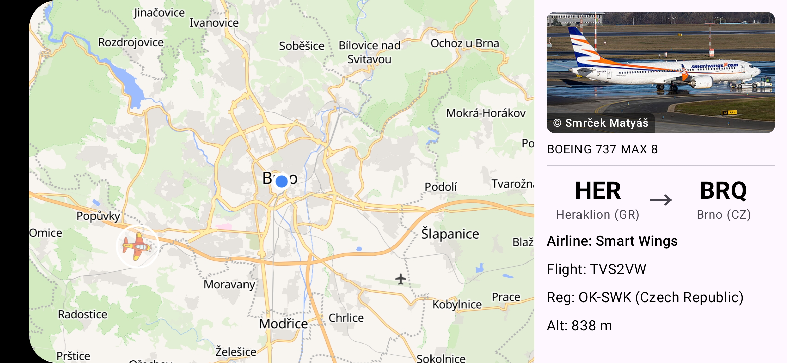

# Airplanes

A simple Android flight tracker that shows aircraft near the user's location on an interactive MapLibre map, with a continuously-cycling detail panel (photo, route, airline, altitude) for each plane in range.

## Data Sources

- [Flightradar24](https://www.flightradar24.com/) — live aircraft positions, routes and airlines.
- [PlaneSpotters](https://www.planespotters.net/) — aircraft photos by registration.
- [OpenFreeMap](https://tiles.openfreemap.org/styles/liberty) — liberty map style (MapLibre SDK).
- Static mappings for airport names, airline names, and registration country prefixes.

## Tech Stack

Jetpack Compose + Material3, MapLibre 13.3.1, Retrofit 2.11 + kotlinx.serialization, OkHttp 4.12, Coil 2.7, Play Services Location.
